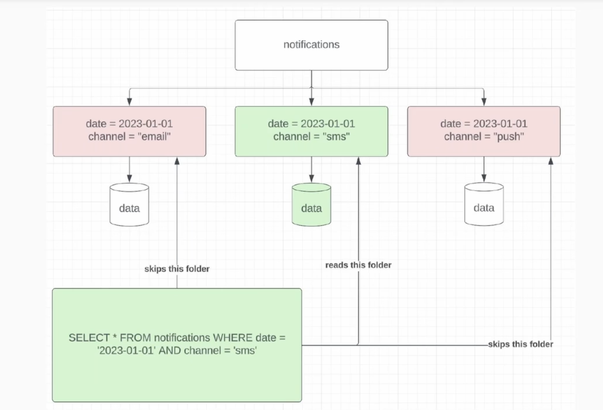

Signs of tech debt in data engineering
- painful pipelines that break or are delayed
- large cloud bills
- multiple sources of truth
- unclear datasets that aren't documented

Path forward for painful pipelines
- the only thing better than optimized is deprecated!
	- sometimes this is the right play, it's worth exploring
	- deprecating without a replacement can be a hard sell
- is there anything that can be done?
	- new technology
		- ex. Hive to Spark migration
			- often sees order of magnitude increase in efficiency, especially for pipelines that use high cardinality `GROUP BY` and/or `JOIN`
	- better data modeling
	- bucketing?
		- Consider when you have an expensive high-cardinality join or group by
	- sampling?
		- When should you sample?
			- If directionality is what you care about, sampling is good enough
			- make sure to consult a data scientist on this to guarantee you get the best sample of the data set
				- for example, do you take a small percentage of all requests, or all requests for a small percentage of users?
		- When should you not sample?
			- if you need the entire dataset for auditing purposes (i.e. finding a needle in a haystack), not a good idea

Large cloud bills
- in the cloud, you basically pay in three places: I/O, compute, and storage
- I/O is normally the biggest cost
	- this is because compute is kind of fixed and storage is pretty cheap
	- a downside of the WAP pattern is that you pay the I/O cost twice - once into staging, and again into production
- Focusing on storage can be a big win if your table has many downstream pipelines reading it in 
- too much I/O can happen because...
	- duplicative data models
		- this can be a communication overhead cost in addition to the cloud bill too
	- inefficient pipelines (use cumulative design when possible)
		- maybe you're reading in 30 days of data every day when you don't need to
	- excessive backfills
		- for example, backfilling years of data hastily only to realize you still had a bug and need to backfill again
	- not sampling
	- not subpartitioning your data correctly
		- predicate pushdown is your friend
		- you want your subpartitions to be low cardinality, and fields that are used in the where clause a lot

Cloud bills continued...
- large IO and compute costs are correlated by
	- scanning too much data (try to use cumulative tables)
	- any O(n^2) algorithms applied in UDFs
- large IO and storage costs are correlated by
	- not leveraging parquet file format effectively
	- duplicative data models

Multiple sources of truth
- this is some of the hardest, but most impactful, work for data engineers
- as companies grow fast, it's common for datasets to get created in a scrappy way when they are needed, and before you know it you have multiple sources of truth
- steps
	- document all the sources and the discrepancies
		- talk with relevant stakeholders
		- if you can code search for similar names that's great
		- if you're company is really on it, they might have lineage you can use as a starting point
	- understand from stakeholders why they needed something different
	- build a spec that outlines a new path forward that can be agreed upon

